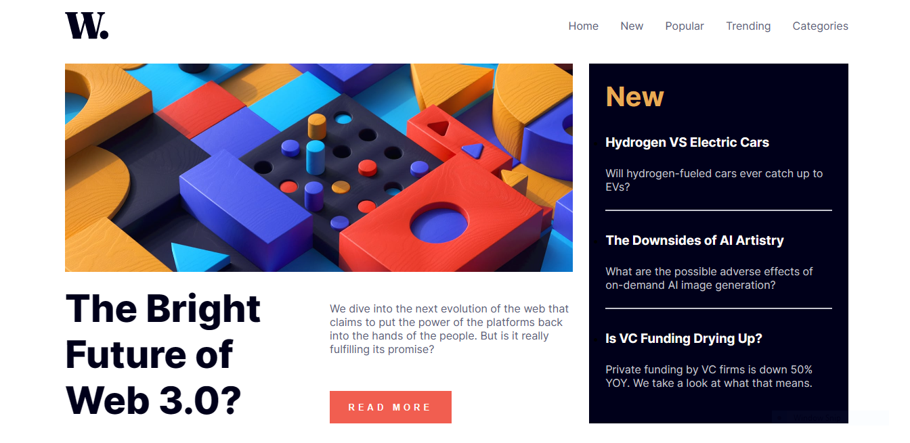

# Frontend Mentor - News homepage solution

This is a solution to the [News homepage challenge on Frontend Mentor](https://www.frontendmentor.io/challenges/news-homepage-H6SWTa1MFl). Frontend Mentor challenges help you improve your coding skills by building realistic projects. 

## Table of contents

- [Overview](#overview)
  - [The challenge](#the-challenge)
  - [Screenshot](#screenshot)
  - [Links](#links)
- [My process](#my-process)
  - [Built with](#built-with)
  - [What I learned](#what-i-learned)
  - [Continued development](#continued-development)
  - [Useful resources](#useful-resources)
- [Author](#author)
- [Acknowledgments](#acknowledgments)

## Overview

To recreate the desktop view of: 

### The challenge

Users should be able to:

- View the optimal layout for the interface depending on their device's screen size
- See hover and focus states for all interactive elements on the page

### Screenshot

My solution:

### Links

<!-- - Solution URL: [Add solution URL here](https://your-solution-url.com) -->
- Live Site URL: 

## My process

Initially I set the padding and margin to 0 and changed the box-sizing to border-box so tht I would be able to accurately design the layout. I then created the custom variables for the different colours that would be used for the design and imported the required font and font-weights.\
I then began to build out the HTML frame for the page and style as needed. It was at this point that I had an issue with using grid-template-areas, upon reaching out to the Frontend Masters community I was given advice to restructure my HTML, this enabled me to gain a better perspective on the design.\
After restructing the page, I then corrected my styling.
### Built with

- Semantic HTML5 markup
- CSS custom properties
- Flexbox
- CSS Grid

### What I learned

This challenge ended up being very useful for learning about HTML structure and grid displays.

### Continued development

This would be a good base for building out a full news website.

## Author

- Website - [Tom Birbeck](https://portfolio-tombirbeck.vercel.app/)
- Frontend Mentor - [@TomBirbeck](https://www.frontendmentor.io/profile/TomBirbeck)

## Acknowledgments

Grace from the Frontend Mentor slack channel was super helpful on this challenge.
